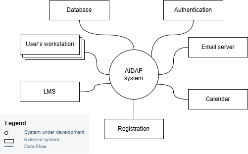
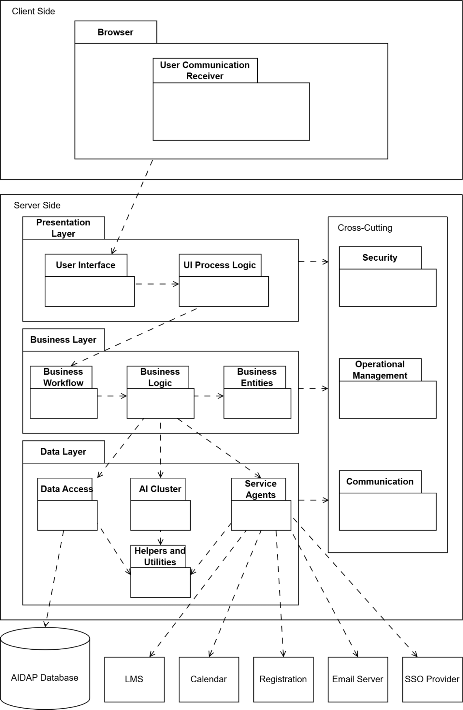
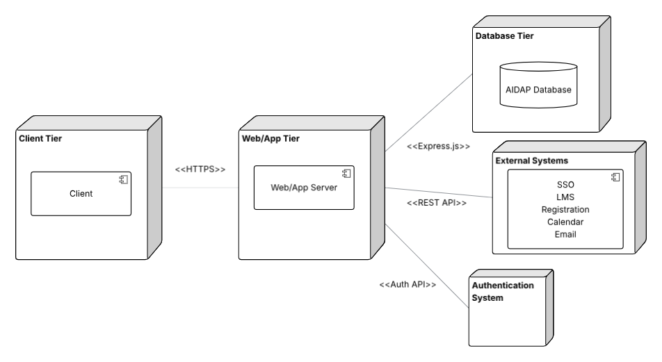

# Iteration 1:

**Step 1: Review Inputs**

| Category | Details |
| :---- | :---- |
| Design purpose | Our system is a greenfield system in a mature domain. We are integrating our AI system with the school’s existing LMS infrastructure. The purpose is to create a design and blueprint for the construction of this system. |
| Primary functional requirements | The primary use cases were determined to be: UC-1: Because it directly supports the core business UC-2: Because it directly supports the core business UC-5: Because it directly supports the core business |
| Quality attribute scenarios | The scenarios have been prioritized as follows: **Scenario ID** / **Importance to the Customer** / **Difficulty of Implementation according to the Architect**: QA-1 High Medium QA-2 High High QA-3 High Low QA-4 Low High QA-5 High Medium From this list, only QA-1, QA-2, QA-3, QA-5 are selected as drivers |
| Constraints | All constraints have been selected as drivers: CON-1: Requires architectural support for security CON-2: Ensures all external communication uses standard APIs CON-3: Requires the system to be deployable as a cloud-native service CON-4: System must comply with institution security CON-5: Support for 5000 concurrent users is necessary CON-6: Defines the reference architecture CON-7: Requires server-side coordination CON-8: The system must handle failures in data sources gracefully CON-9: Zero-downtime deployment requires an architecture that supports component replacement |
| Architectural concerns | All concerns have been selected as drivers: CRN-1: Must establish an initial system structure that integrates the institution’s existing academic data source systems through a unified interface. CRN-2: Consistent role-based access will be enforced so students, lecturers, administrators, and maintainers only access permitted operations. CRN-3: Support for configurable AI model management (versions, keys, policies) while keeping deployment and changes controllable by system maintainers. CRN-4: Service is reliable with clear backup/rollback procedures and fault detection to handle external data source outages. |

**Step 2: Establish Iteration Goal**  
The goal of this iteration is to establish an overall system structure. This will also go a long way to achieving CRN-1, thus it will be our main iteration goal.  
The design of the overall system is also influenced by the following:

* QA-1: Performance  
* QA-2: Availability  
* QA-3: Security   
* CON-3: The system can be deployed to the cloud and be scalable.  
* CON-6: The system supports browser accessible multi-device (Windows, Mac, Linux, mobile devices) usage.   
* CON-7: The system must maintain data integrity across all connected systems.

**Step 3: Choose one or more elements of the system to decompose**  
This is a greenfield development effort, we will be targeting the AIDAP system for decomposition. The developing system will be the main target but will also be shown alongside its various integrations with the existing institution systems. Other elements are already fully developed external services which provide their services through interfaces, or are not required for the implementation of our system.  
**Step 4: Choose one or more design concepts that satisfy the selected drivers**

| Design Decisions and Location | Rationale |
| :---- | :---- |
| Logically structure the client and server parts of the system using the Web Application Reference Architecture. | The system is going to be integrated with the existing web-based LMS system. It will need a web browser client-side interface to allow users (students, lecturers) to use the AIDAP system (QA-5, UC-1, UC-2, UC-5). It must be accessible using an internet connected browser instead of being installed on the client’s machine (CON-3). **Discarded Alternatives:** **Alternative Rationale** Rich internet applications The AIDAP system only requires a traditional website and does not require a rich client-side interface to handle its relatively simple user transactions. Rich client applications Intended for locally installed desktop applications rather than a browser based client. Mobile applications Oriented toward handheld devices. The system must be accessible on larger, non-mobile web and voice-assistant devices in addition to handheld devices. Service applications Service applications satisfy the functionality wanted in the business and data layers but does not provide an UI.  |
| Physically structure the application using the Distributed Three-Tier Deployment Pattern | A three-tier deployment pattern is the most appropriate choice. It preserves a clear separation of concerns between presentation, processing, and data management, ensuring that each tier can scale independently. This supports the system’s primary use cases (UC-1, UC-2, UC-5) and meets constraints requiring reliable performance, high availability, and support for over 5000 concurrent users (CON-3 and CON-5). **Discarded Alternatives:** / **Alternative Rationale** Nondistributed deployment: Rejected because it cannot provide the required security for institutional data (QA-3) or support the authentication and privacy requirements of the system. Placing all components on a single node increases risk and does not meet institutional expectations for protected academic information. / Two-tier distributed deployment: Not suitable because placing all server-side responsibilities in a single tier weakens structural separation, complicates interactions with external systems (CON-2), and is unable to support the required concurrency of 5000+ users (CON-5). / Four-tier distributed deployment While it offers additional separation between the web server and application server, this added separation does not significantly improve the specific security or performance goals.  |
| Build the UI and UI logic of the AIDAP system using React.js and Node.js  | A widely used web development standard that ensures conformity with modern interactive web programming standards. Allows easy adaptation for cloud computing (CON-3). Alternatives like Javascript \+ PHP were considered, but they require proficiency in 2 languages, extending development time. The React.js and Node.js UI framework allows for a single unified programming language to be used. React.js with Node.js is also more suited to modern web development compared to alternatives. |
| Implement Express.js for handling server-side interactions  | Express.js is a flexible and minimal Node.js web application framework. It will be responsible for handling user requests and sending AIDAP system responses back to the user. Express.js integrates well with the three-tier architecture because it keeps routing, middleware, and business logic clearly separated. Express.js natively supports JSON communication and integrates easily with REST API, directly supporting the interoperability requirement (CON-2). It also provides convenient support for authentication and communication with external institutional systems. Other tools like PHP were considered, but Express.js meshes the best with Node.js given the language is the same. |

**Step 5: Instantiate architectural elements, allocate responsibilities and define interfaces**

| Design Decision and Location | Rationale |
| :---- | :---- |
| Introduce Service Agent modules for LMS, Calendar, Registration and Email Systems | The system must integrate with multiple external school systems. Service Agents abstract communication with external services, hiding protocol and formatting details while supporting interoperability (QA-2), security (QA-3), and UC-1, UC-2, UC-5.  |
| Remove Application Facade module from the business layer | Our system does not require a centralized component since each business module already exposes its own functionality cleanly through the Presentation Interface layer, removing the facade reduces the architectural complexity and avoids introducing an unnecessary layer. (CON-1) |
| Add User Communication Receiver module | This module will handle user transactions that happen in data formats other than text. It is needed to create an environment for the user to record their voice. Sound recordings get sent to the Business Layer for further processing (QA-5). |
| Add an AI cluster to Data Layer | This module will be responsible for holding the locally hosted AI cluster. It is an important module for satisfying most primary drivers. It will be more secure than accessing an LLM provided by an external service (QA-3). |

**Step 6: Sketch views and record design decisions**

Architectural Diagram:  
 
Module and Layer Descriptions:

| Element | Responsibility |
| :---- | :---- |
| Client/Browser Layer | This layer contains the browser that users will use to see and use the AIDAP UI. It presents the data in the Presentation Layer. |
| User Communication Receiver | Correctly receives the type of data (text or voice) transmission the user passes. The inclusion of this package is appropriate for satisfying QA-5. |
| Presentation Layer | This layer provides the UI of the AIDAP system and allows the user to interact with and send data to the system. |
| User Interface  | Presents a UI for the users that receives and presents information to the users.  |
| UI Process Logic | Manages dynamic screens and UI behaviour in the browser. It updates the interface when data changes and coordinates UI components. This module will capture user actions in the UI and pass it to the Business Layer. |
| Business Layer | This layer handles the user’s requests. It also fetches and sends data to the Data Layer. |
| Business Workflow  | These modules coordinate multi step operations that require multiple business processes or interactions with external systems. |
| Business Logic | These modules apply the system's core rules and computations and decide how requests should be processed. |
| Business Entities | These modules represent the domain objects used throughout the system, such as configurations, users, and session data. |
| Data Layer | This layer provides interfaces for accessing the database and any external services. Also contains the AI components of the system. |
| Data Access | This module handles persistent storage operations and manages interaction with the database. Required for CRN-1, CON-2, CON-7, UC-2, UC-5. |
| Helpers and Utilities | Contains shared functionality, logging, formatting, monitoring, and is used across the data layer. Needed for CRN-1. |
| Service Agents | This module will communicate with all necessary institution external systems on behalf of the server. Encapsulates API calls, authentication, retries, translation logic, and error management (CRN-1, CRN-4). |
| AI Cluster | A locally hosted instance of an open-source LLM. Allows prompting from the Business Layer and produces appropriate responses to prompting (Required for all primary use cases). Also includes an AI-powered Automatic Speech Recognition module to satisfy QA-5. |
| Cross-Cutting Layer | This layer is used as part of every layer and provides extra security, communication and management protocols. |
| Security | Provides authentication, authorization, and related safeguards across the system. Uses the institution’s SSO system. Applies security policies uniformly across all layers (QA-3, CON-1). |
| Operational Management | Provides monitoring, logging, metrics, and system health tracking across layers. |
| Communication | Provides shared communication utilities and protocols across different modules and tiers. Helpful for establishing CRN-1. |
| LMS | This external system provides course user and learning related data that the service agents retrieve or update (CRN-1). |
| Calendar | This external system manages scheduling information that the service agents access to read or modify the calendar events (CRN-1). |
| Registration System | This external system handles student enrollment and registration data that the service agents integrate with (CRN-1). |
| Email Server | This external system sends emails and notifications triggered by the application through the service agents (CRN-1). |
| SSO Provider | This external system adapts the Institution’s trusted SSO provider into the AIDAP system (QA-3, CRN-2, CON-1, CON-4).  |
| AIDAP Database | This data store holds the system’s persistent data, including but not limited to: conversational history, user preferences, and logs accessed through the data access modules. The data is stored independently of the school’s existing systems to reduce their complexity. |

Deployment Diagram:  

| Element | Responsibility |
| :---- | :---- |
| Client Tier | The user’s machine, which runs the client side logic of the application. |
| Web/App Tier | Delivers web content, processes application logic, handles AI requests, and communicates with external institutional systems. |
| Database Tier | The server is dedicated to maintaining data storage. |
| SSO | The university’s authentication provider, external to the AIDAP system. |
| Institutional Systems (LMS, Registration, Calendar, Email) | External university-managed platforms that provide academic and administrative information. |

| Relationship | Description |
| :---- | :---- |
| Between client tier and web/app server | Communication uses HTTPS to deliver the client and send user requests. |
| Between web/app server and database server | Communication with the database will be done using Express.js. |
| Between web/app server and external systems | External systems are accessed using REST APIs provided by institutional services. |
| Between web/app server and authentication system | Authentication is performed using an authentication API determined by the institution SSO. |

**Step 7: Perform analysis of current design and review iteration goal and design objectives (Kanban Board).**

| Not Addressed | Partially Addressed | Completely Addressed | Design Decisions Made During Iteration |
| :---- | :---- | :---- | :---- |
|  | UC-1 |  | Selected reference architecture establishes modules that will support this functionality. |
|  | UC-2 |  | Selected reference architecture establishes modules that will support this functionality. |
|  | UC-5 |  | Selected reference architecture establishes modules that will support this functionality. |
| QA-1 |  |  | No relevant decisions made. Elements that participate in the use case which is associated with the scenario are not yet identified. |
| QA-2 |  |  | No relevant decisions made. Elements that participate in the use cases which are associated with the scenario are not yet identified. |
|  | QA-3 |  | Integration with the institution’s SSO provider has been planned at the architectural level with the external services and the Security module. However, no specific internal security and privacy technologies have been selected. |
|  | QA-5 |  | Handled by the User Communication Receiver module in the Browser and the AI Cluster module. Specific technologies have not been decided. |
|  |  | CON-1 | Integration with the institution’s SSO provider has been planned at the architectural level with the Security module. System integration with external SSO provider has also been established in the Data Layer.  |
|  |  | CON-2 | Service agents made using Express.js for accessing external systems have been included. They will use the unified REST API for interactions. |
|  | CON-3 |  | Implementation using standardized technologies like React.js and Node.js should allow easier transferral to cloud. However, specific processes surrounding cloud-native computing have not been decided. |
|  | CON-4 |  | The Security module in the Cross-Cutting layer partially addresses the need for institutional security standards, but no related technologies have been decided. Institutional SSO has also been included as an external service. |
|  | CON-5 |  | The architecture supports scaling by separating the web and application tiers, however detailed load-balancing strategies have not been decided. |
|  |  | CON-6 | The Web Application Architecture enables support for mobile, web, and voice-assisted devices. Device browser support is required, but proper implementation of front-end React.js and Node.js ensures compatibility of the system across devices. |
| CON-7 |   |  | Connections to external services have been established in the architecture. However, no decisions have yet been made regarding cross-system consistency mechanisms. |
| CON-8 |  |  | No decisions have been made addressing failures in data source availability. |
| CON-9 |  |  | Zero-downtime deployment strategies have not been addressed. |
|  |  | CRN-1 | External institution services will be accessed by the AIDAP system using the unified REST API.  |
|  | CRN-2 |  | Not directly addressed but the cross-cutting Security module will support the implementation of role-based access. The Institution’s external SSO provider has also been established in the architecture. However, specific technologies for security within the system are not yet considered. |
|  | CRN-3 |  | Not directly addressed but the AI Cluster module in the Data Layer exists as a container for a modifiable AI module. |
| CRN-4 |  |  | No relevant decisions were made surrounding backups and failstates. |
