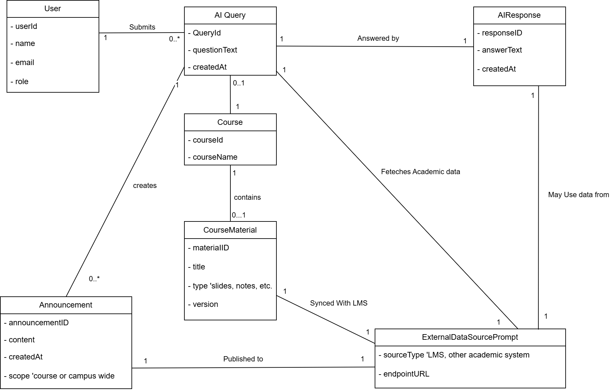
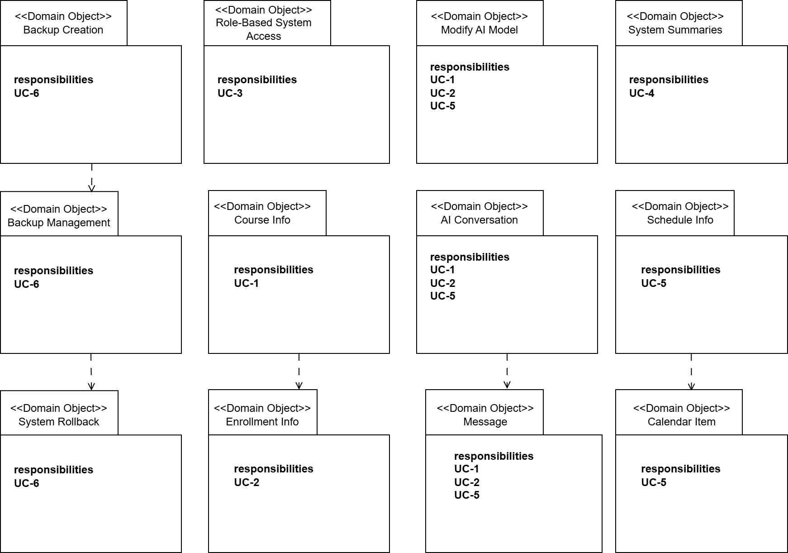
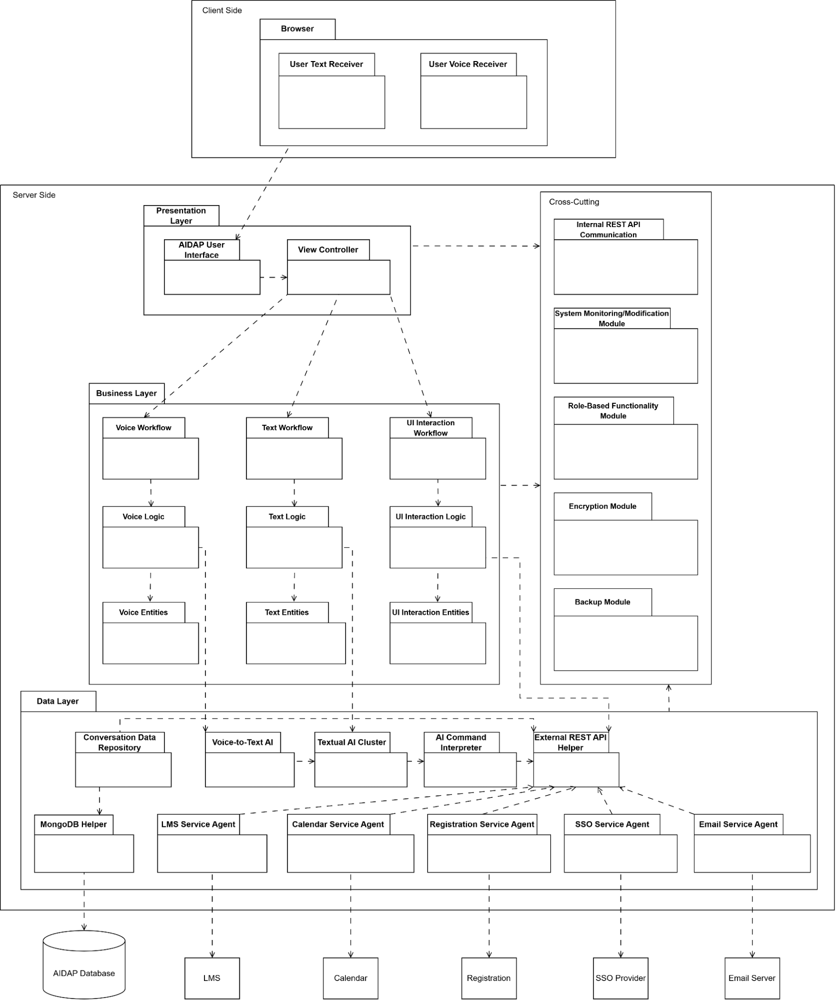

# Iteration 2:

**Step 2: Establish Iteration Goal**

The goal of this iteration is to address the general architectural concern of identifying structures to support primary functionality. As well as to cover some of the unaddressed design objectives in Iteration 1, particularly those related to CON-3, by establishing what is required for the system to support cloud-native deployment.

| Category  | Details |
| :---- | :---- |
| Primary Functional Requirements | UC-1: Because it directly supports the core business UC-2: Because it directly supports the core business UC-5: Because it directly supports the core business |
| Quality Attribute Scenarios | QA-1 \- A student queries academic information through the AI assistant. The system processes requests within 2 seconds on average under normal load. QA-2 \- The system remains accessible and operational 99.5% of the time each month. Maintenance or deployment operations do not interrupt ongoing user sessions. QA-3 \- A user logs into the system through the institutional single sign-on (SSO). The system verifies authentication and ensures that user-specific information remains accessible only to the authenticated user. QA-5 \- A user interacts with the assistant via text or voice, and the system interprets the input correctly, providing clear, contextually appropriate responses that allow the task to be completed efficiently. |
| Constraints | All constraints documented in phase 1\. |
| Architectural Concerns | All architectural concerns in phase 1\.  |

**Step 3: Choose One or More Elements of the System to Refine**

The elements refined in this iteration are the modules located in the layers defined by the web-application reference architecture and the three-tier deployment pattern from Iteration 1\. This iteration focuses on refining the modules within them and identifying how they collaborate to support the system's primary functionality.   
Iteration 1 also does not address every design objective, thus we are also targeting some of the design objectives that were left partially addressed (QA-3, QA-5, CON-3, CON-4). Structures and modules for most partially addressed design objectives will be defined in this iteration. Some design objectives will be fully addressed in later iterations.

**Step 4: Choose One or More Design Concepts That Satisfy the Selected Drivers** 

| Design Decisions and Location | Rationale and Assumptions |
| :---- | :---- |
| Create a Domain Model for the application | An explicit domain model is required to identify the major entities and the relationships among them. This provides a structured foundation for further decomposition and ensures that responsibilities can be assigned consistently across the architectural layers. No alternatives were considered, as a domain model is fundamental to developing a coherent architecture. |
| Identify Domain Objects that map to functional requirements | The system’s functionality must be aligned to specific domain objects that represent the core concepts of the application. Each distinct functional aspect of the system should be encapsulated within a clearly defined domain object to ensure coherent responsibility allocation. An alternative would be to skip identifying domain objects and decompose layers directly into modules, but this risks overlooking requirements and producing an incomplete or inconsistent structure. |
| Decompose Domain Objects into general and specialized Components | Some domain objects represent broad concepts and require decomposition into more specific components to support modularity and maintainability. This decomposition ensures that each part of the system has a focused responsibility and can be refined independently during later iterations. Specialization of modules is based on the layers (Presentation, Business, Data, Cross-cutting) they are associated with.  There are no good alternatives for decomposing the domain layers into modules that support functionality. |
| Use MongoDB for the AIDAP database. | Storing AI interactions (UC-2) requires large amounts of unstructured storage. No SQL solutions like MongoDB do not require a Schema, and easily handle unstructured data. MongoDB is flexible and scalable, which makes it a fit for this application. No SQL solutions allow storage of entire conversations as objects, storing all elements (user query, model response, and all related metadata) as a single document. MongoDB is also the preferred database system for Express.js (forming the MERN stack). Other SQL-based database solutions (MySQL) were considered, but they lack flexibility in the data structures needed to store AI interactions.  |
| Use JSON Web Tokens (JWT) for role-based access tokens | After a successful login, the Express.js server generates a JWT. This is a small, signed token containing user information. This token will be used to determine the role of the user and what they can access with their permissions (QA-3, CRN-2). No alternative web token systems were considered as the AIDAP is an implementation of a MERN (MongoDB, Express, React, Node) stack and JWT is the industry standard for it. |
| Use Docker for containerization | Docker is required to make the AIDAP system deployable as a cloud-native service (CON-3). Containerizing the Presentation, Business, and Data components ensures consistent deployment across environments and supports scaling demands associated with handling 5000 concurrent users (CON-5).  No simpler alternative provides the portability and reproducibility needed for cloud-native delivery. |
| Use Kubernetes for orchestration | Kubernetes provides automated scaling, load distribution, and rolling updates, which directly support cloud-native deployment (CON-3), handling high concurrency (CON-5), and enabling zero-downtime updates (CON-9).  Other orchestration methods cannot meet these constraints reliably. |

**Step 5: Instantiate Architectural Elements, Allocate Responsibilities, and Define Interfaces**

| Design Decisions and Location | Rationale |
| :---- | :---- |
| Create an initial domain model for the AIDAP system focused on the use cases   | An initial domain model identifies the key concepts the system must manage and provides a consistent foundation for structuring all layers. Focusing only on the concepts needed for the primary use cases keeps the model manageable while still supporting the system’s most important behaviour. |
| Instantiate Domain Objects that map directly to functional requirements | Each primary use case is mapped to the domain objects that carry out the required behaviour. For example, conversation-related behaviour is handled by AI Conversation and Message. To address all architectural concerns, all use cases, including ones that are non-primary, are present in the diagram. |
| Decompose domain objects into layer specific modules in the Presentation, Business, and Data layers. | The responsibilities of each domain object are split across the layers according to their nature. Presentation-layer modules provide views and view-models for the domain concepts, the Business layer encapsulates rules and workflows around those concepts, and the Data layer manages storage and retrieval. This decomposition keeps concerns separated, supports independent evolution of UI, business rules, and persistence, and makes the overall structure easier to understand and maintain. |
| Introduce explicit service interfaces for core domain operations in the Business layer | Core operations over the domain model are grouped into well-defined services, such as voice, text, or UI-based (CON-2). These services expose explicit interfaces that are used by the Presentation layer and hide the internal structure of business logic and workflows. This creates stable interaction points between layers, simplifies testing and substitution of implementations, and reduces the impact of changes in business rules on other parts of the system. |
| Define persistence and integration mappings for domain objects in the Data Access and Service Agent modules | For domain concepts that must be stored or obtained from external systems, dedicated mappings are defined in the Data Access and Service Agent modules (CON-2). Repositories and mappers translate between domain objects and database structures, while Service Agents adapt domain level operations to the APIs of LMS, Registration, Calendar, and Email systems (CON-2). Centralizing these mappings keeps the business logic independent of storage formats and external protocols and makes it easier to adapt when schemas or external APIs change (CON-2, CON-7). |

**Step 6:  Sketch Views and Record Design Decisions Based On Step 5**

Initial Domain Diagram:

Domain objects associated with the use case model (Key: UML):

Modules that support the use cases:

| Element | Responsibility |
| :---- | :---- |
| Client/Browser Layer | This layer contains the browser that users will use to see and control the AIDAP UI. It visually presents the data in the Presentation Layer.  |
| User Text Receiver | Records text inputted by the user. The browser will send the data to the presentation layer. (QA-5, CON-6). |
| User Voice Receiver | Records voice samples from the user. Uses the browser’s in-built recording function. (QA-5, CON-6). |
| Presentation Layer | This layer provides the UI formatting of the AIDAP system. Has various UI elements that allow user interaction, and will send data to the business layer. |
| AIDAP User Interface | Built using HTML and React.js, it provides the UI structure and look of the AIDAP system. Is only responsible for the visual component of the UI. |
| View Controller | Built using Node.js, contains the necessary elements to allow elements of the UI to be changed according to data. Is responsible for interacting with the Business Layer and deciphering how the user is interacting with the UI. Depending on the user, it can change what the UI displays. Is also responsible for the sign-in page. It is important for all use cases. |
| Business Layer | This layer handles the logical portion of the user’s requests. It also fetches and sends data to the Data Layer. |
| Voice Workflow | Controls the steps needed to get the user’s voice into clean, software-recognisable speech (removing noise, boosting frequencies, etc.). (QA-5, CON-6). |
| Voice Logic | Contains the algorithms needed to clean up parts of a voice recording. (QA-5, CON-6). |
| Voice Entities | Contains various data about the user’s voice recording like length, size, time of recording, content, etc. (QA-5, CON-6). |
| Text Workflow | Controls the steps needed to get the user’s text into clean strings of text. (removing certain characters, upper case, etc.). (QA-5, CON-6). |
| Text Logic | Contains the algorithms needed to clean up parts of a user’s text input. (QA-5, CON-6). |
| Text Entities | Contains various data about the user’s text recording like length, time of sending, content, etc. (QA-5, CON-6). |
| UI Interaction Workflow | Controls the steps needed to get the user’s actions on the UI into the rest of the system (clicking on send, clicking record, clicking on a historical conversation, etc.).  |
| UI Interaction Logic | Contains the algorithms needed to make the user’s actions on the UI go through and reach the correct layers. |
| UI Interaction Entities | Contains various data about the user’s action on the UI like which button was pressed, time of sending, etc. |
| Data Layer | This layer provides interfaces for accessing the AIDAP database and any external services. It contains the AI components of the system. It also provides available actions to the AI so that it may interface with the external systems. |
| Conversation Data Repository  | Provides an interface to access recorded conversations in the AIDAP Database. |
| MongoDB Helper | Translates commands from within the system to MongoDB prompts. Supports the creation of the Conversation Data Repository. |
| Voice-to-Text AI | Interprets voice recordings and returns a series of words based on what was said in the recording. (QA-5, CON-6). |
| Textual AI Cluster | A container for an open-source LLM that reads input text and creates a text-based reply. (QA-5, CON-6). |
| AI Command Interpreter | Based on the Textual AI reply, it can access various external services for use. For example, posting announcements to LMS or fetching academic information. (UC-1, UC-2, UC-5). |
| External REST API Helper | The Institution’s systems will interact with AIDAP using REST APIs. This module is here to translate and regulate the transferral of data for all external services. (CON-2, CON-7). |
| LMS Service Agent | Acts as an interface for the Institution’s LMS. |
| Calendar Service Agent | Acts as an interface for the Institution’s Calendar service. |
| Registration Service Agent | Acts as an interface for the Institution’s Registration. |
| SSO Service Agent | Acts as an interface for the Institution’s SSO Provider. |
| Email Service Agent | Acts as an interface for the Institution’s Email service. |
| Cross-Cutting Layer | This layer is used as part of every layer and provides extra security, communication and management protocols. |
| Internal REST API Communication | Responsible for establishing a standard communication protocol within the AIDAP system. (CON-7). |
| System Monitoring/Modification Module | Allows certain users to modify (change or modify AI, change access, etc.) parts of the AIDAP system. It also allows monitoring of the AIDAP system to ensure system stability. (UC-4) |
| Role-Based Functionality Module | Ensures role-based access within AIDAP. Uses JSON Web Tokens to accomplish the task. For example: a student should not be able to access the same content as a lecturer. (QA-3, CRN-2). |
| Encryption Module | Encrypts data communication within the AIDAP system layers for extra privacy. (CON-4). |
| Backup Module | Controls the storage, retrieval and usage of backups. Certain users can use backups to restore system state from this module. (UC-6, QA-4, CRN-4, CON-8) |
| LMS | This external system provides course user and learning related data that the service agents retrieve or update (CRN-1). |
| Calendar | This external system manages scheduling information that the service agents access to read or modify the calendar events (CRN-1). |
| Registration System | This external system handles student enrollment and registration data that the service agents integrate with (CRN-1). |
| Email Server | This external system sends emails and notifications triggered by the application through the service agents (CRN-1). |
| SSO Provider | This external system adapts the Institution’s trusted SSO provider into the AIDAP system (QA-3, CRN-2, CON-1, CON-4).  |
| AIDAP Database | This data store holds the system’s persistent data, including but not limited to: conversational history, user preferences, and logs accessed through the data access modules. It will also be responsible for storing backups of the system. The data is stored independently of the school’s existing systems to reduce their complexity. (UC-6, QA-4, CRN-4, CON-8). |